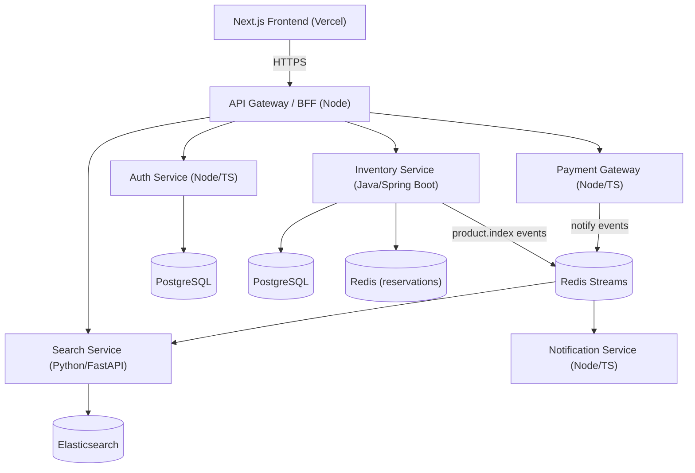

# ShodaiHub — B2B Wholesale Marketplace 🇧🇩

> A production-grade, multi-vendor **B2B wholesale marketplace** built for the Bangladeshi market —
> connecting bulk suppliers with retailer buyers through tiered pricing, concurrency-safe stock
> reservations, multi-vendor checkout, fuzzy product search, and per-supplier fulfilment.

<p align="left">
  
  
  
  
  
  
  
</p>

---

## ✨ Highlights

- **Multi-vendor marketplace** — suppliers, retailers, and administrators with role-based access.
- **Tiered quantity pricing** — per-product price breaks (buy more, pay less per unit) with strict
  overlap/range validation.
- **Concurrency-safe inventory reservations** — Redis + atomic Lua scripts hold stock for 15 minutes
  during checkout; an oversell invariant (`reserved + committed ≤ stock`) is enforced and
  property-tested under real concurrent load.
- **Multi-vendor cart & order splitting** — one cart spanning many suppliers splits into independent
  per-supplier sub-orders under a single parent order.
- **Fuzzy product search** — Elasticsearch with edit-distance-2 matching (`"hilsha"` → *Hilsa*),
  filters, and pagination.
- **Local payments** — bKash / Nagad / SSLCommerz gateway with callback authenticity (HMAC) and
  idempotency.
- **Fulfilment state machine** — PENDING → CONFIRMED → PACKED → SHIPPED → DELIVERED (+ CANCELLED),
  with order tracking and a supplier Kanban board.
- **Bilingual & localized** — English / বাংলা (next-intl) with BDT (৳) currency formatting.
- **Modern, responsive UI** — a custom design system (deep-teal + amber), real photography, and a
  fully responsive layout from mobile to desktop.

## 🏗️ Architecture

A polyglot microservices backend behind a single API gateway, with a Next.js storefront.



| Service | Stack | Responsibility |
|---|---|---|
| **Frontend** | Next.js 14 (App Router), TypeScript, Tailwind | Storefront, supplier & admin consoles, i18n, BDT |
| **API Gateway / BFF** | Node.js + Express | JWT verification, correlation IDs, routing, rate limiting |
| **Auth** | Node.js + TypeScript | Registration, RS256 JWT + refresh rotation, lockout, audit log |
| **Inventory** | Java 21 + Spring Boot 3 | Catalog, tiered pricing, stock, Redis reservations, cart, orders, fulfilment, reviews |
| **Search** | Python 3.12 + FastAPI | Elasticsearch indexing + fuzzy search |
| **Payment** | Node.js + TypeScript | bKash/Nagad/SSLCommerz, callback authenticity + idempotency |
| **Notification** | Node.js + TypeScript | In-app/email delivery with retry/backoff, i18n |

**Data stores:** PostgreSQL (per service), Redis (reservations + event streams), Elasticsearch.

## 🚀 Quick start

### Option A — Frontend only (standalone, no backend)
The storefront ships with a rich **mock-data layer**, so it runs fully on its own (ideal for Vercel).

```bash
cd frontend
npm install
npm run dev           # http://localhost:3000
```

Demo logins (any password): `retailer@shodaihub.test`, `supplier@shodaihub.test`, `admin@shodaihub.test`.

### Option B — Full stack (Docker Compose)
```bash
cp .env.example .env
docker compose up -d            # Postgres ×N, Redis, Elasticsearch, all services
# Frontend against the live gateway:
cd frontend && NEXT_PUBLIC_USE_MOCKS=false NEXT_PUBLIC_BFF_URL=http://localhost:8080 npm run dev
```

## 🖼️ Product imagery (optional)
Real photography is fetched from Unsplash at build time with graceful SVG-placeholder fallback:

```bash
cd frontend
# add UNSPLASH_ACCESS_KEY=... to .env.local
npm run fetch:images
```

## 🌐 Deployment

- **Frontend → Vercel.** Set project root to `frontend/`, env `NEXT_PUBLIC_USE_MOCKS=true`
  (standalone) or point `NEXT_PUBLIC_BFF_URL` at a hosted gateway.
- **Backend → Render / Kubernetes.** See `deploy/` for `render.yaml`, Kubernetes manifests, and
  `DEPLOYMENT.md`.

## 🧪 Testing
The backend is verified with **property-based testing** (jqwik / fast-check / Hypothesis) covering
pricing resolution, the reservation oversell invariant, order-splitting totals, payment idempotency,
and the fulfilment state machine, plus integration tests on Testcontainers (Postgres/Redis/ES).

```bash
npm test                 # Node services + frontend (Vitest)
cd services/inventory && ./gradlew test
cd services/search && pytest
```

## 📁 Project structure
```
frontend/            Next.js storefront (TypeScript, Tailwind, next-intl)
services/
  auth/              Node.js auth service
  bff/               API gateway / backend-for-frontend
  inventory/         Java/Spring Boot core (pricing, reservations, orders)
  search/            Python/FastAPI search service
  payment/           Node.js payment gateway
  notification/      Node.js notification service
packages/shared-node/  Shared Node libs (errors, logging, correlation IDs)
deploy/              Docker, Kubernetes, Render + Vercel config
```

## 📄 License
UNLICENSED — portfolio/demonstration project.

---

<sub>Photography via Unsplash. Built as a demonstration of enterprise B2B marketplace architecture.</sub>
